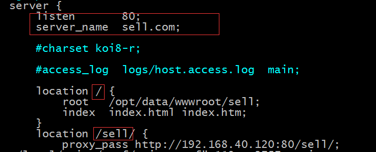

# 微信点餐系统

推荐一个Spring boot的教程,写的超棒: http://gitbook.cn/gitchat/column/59f5daa149cd4330613605ba

**本项目配套视频**

慕课网项目地址:http://coding.imooc.com/class/117.html

视频下载地址: 链接：https://pan.baidu.com/s/1slKAZQ9 密码：8a7p

---

-------------------分割线---------------------------------

首页地址: http://192.168.41.60/#/goods

设置openid :document.cookie="openid=123"

修改nginx:

配置文件: vim /usr/local/nginx/conf/nginx.conf

重启nginx: nginx -s reload 

如果配置在微信,需要使用域名,开发环境中这样配置

意思是:nginx监听服务器80端口,

* (前台页面) 当拦截到到 http://sell.com/index.html ,就转发请求到 /opt/data/wwwroot/sell 目录下

* (后台接口) 当拦截到 http://sell.com/sell/* 时,就转发请求到 http://192.168.40.120:80/sell 

另外需要在自己及其上更改host文件呢绒,配置 sell.com 域名,即: **服务器IP地址 sell.com**

        192.168.41.60 sell.com

