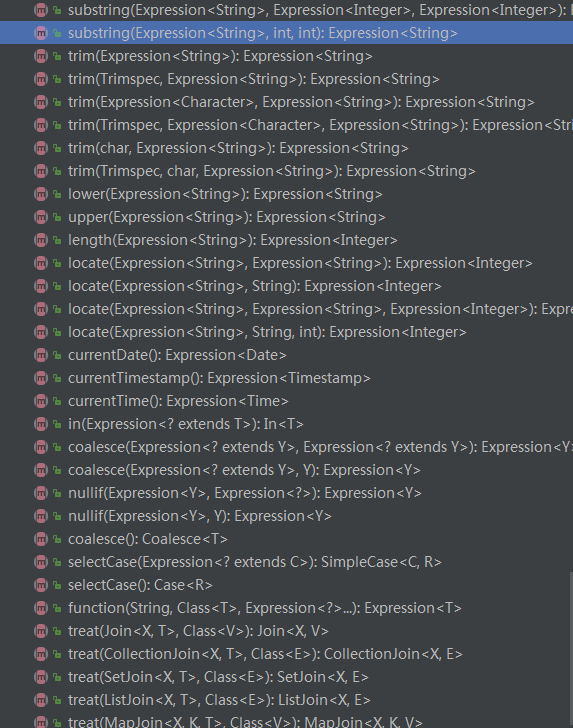

# Spring Data JPA

首先了解 JPA 是什么？

JPA（Java Persistence API）是 Sun 官方提出的 Java 持久化规范。
它为 Java 开发人员提供了一种对象/关联映射工具来管理 Java 应用中的关系数据。它的出现主要是为了简化现有的持久化开发工作和整合 ORM 技术，
结束现在 Hibernate、TopLink、JDO 等 ORM 框架各自为营的局面。
值得注意的是，JPA 是在充分吸收了现有 Hibernate、TopLink、JDO 等 ORM 框架的基础上发展而来的，具有易于使用、伸缩性强等优点。
从目前的开发社区的反应上看，JPA 受到了极大的支持和赞扬，
其中就包括了 Spring 与 EJB 3.0 的开发团队。

> 注意：JPA 是一套规范，不是一套产品，那么像 Hibernate、TopLink、JDO 它们是一套产品，如果说这些产品实现了这个 JPA 规范，那么就可以叫它们为 JPA 的实现产品。
Spring Data JPA

Spring Data JPA 是 Spring 基于 ORM 框架、JPA 规范的基础上封装的一套 JPA 应用框架，可使开发者用极简的代码即可实现对数据的访问和操作。它提供了包括增删改查等在内的常用功能，且易于扩展！学习并使用 Spring Data JPA 可以极大提高开发效率！

> Spring Data JPA 让我们解脱了 DAO 层的操作，基本上所有 CRUD 都可以依赖于它来实现。

先上例子:

```java
package com.itguang.weixinsell.repository;

import com.itguang.weixinsell.entity.ProductInfoEntity;
import org.springframework.data.jpa.repository.JpaRepository;
import org.springframework.data.jpa.repository.Query;
import org.springframework.data.repository.query.Param;

import java.util.List;

public interface ProductInfoRepository extends JpaRepository<ProductInfoEntity, String> {

    List<ProductInfoEntity> findAllByProductName(String name);


    /**
     * 使用约定命名规则
     * @param name
     * @param price
     * @return
     */
    List<ProductInfoEntity> findByProductNameStartingWithAndProductPriceLessThan(String name, Double price);

    List<ProductInfoEntity> findByProductNameInAndProductPriceLessThan(List<String> names, Double price);

    /**
     *使用JPA SQL语句
     * @return
     */
    @Query("select p from ProductInfoEntity p where p.productName like '%米%' ")
    List<ProductInfoEntity> findProductInfo();

    /**
     * 使用JPA SQL语句 查询价格最高的商品
     */
    @Query("select p from ProductInfoEntity p " +
            "where p.productPrice=" +
            "(select max(p2.productPrice) from ProductInfoEntity  p2)")
    List<ProductInfoEntity> findMaxPrice();

    /**
     * 使用JPA SQL语句 带参数的查询1
     *
     * @param name
     * @param price
     * @return
     */
    @Query("select o from ProductInfoEntity  o where o.productName=?1 and o.productPrice=?2")
    List<ProductInfoEntity> findParam(String name, double price);


    /**
     * 使用JPASQL语句 带参数的查询2
     *
     * @param name
     * @param price
     * @return
     */
    @Query("select o from ProductInfoEntity  o where o.productName=:name and o.productPrice=:price")
    List<ProductInfoEntity> findParam2(@Param("name") String name, @Param("price") double price);

    /**
     * 使用原生SQL语句 查询
     * @return
     */
    @Query(nativeQuery = true,value = "select count(*) from product_info")
    Integer getCount();


}


```


## 借助 Spring Data实现自动化的JPA Repostory

### 查询方法定义的规则和使用


编写Spring Data JPA Repository 的关键在于从一组接口中挑选一个进行扩展.

如:

```java
public interface ProductCategoryRepository extends JpaRepository<ProductCategoryEntity,Integer> {
}
```


 添加注解能到达到不用  extends JpaRepository 的功能

`@RepositoryDefinition(domainClass = Employee.class, idClass = Integer.class)`

这里,ProductCategoryRepository扩展了 JpaRepository 接口,稍后我们会介绍其它几个接口.


通过这种方式,JPARepository 进行了参数化,所以它就能知道这是一个用来持久化 ProductCategoryEntity 的Repository.
并且id类型为 Integer .

另外,它还会集成18个执行持久化操作的通用方法.

**在spring boot 中,如果使用了 spring-boot-starter-data-jpa ,会自动扫描所有扩展了Repository 接口的类,如果是Spring,则需要开启 Repository扫描**

因为 ProductCategoryRepository 扩展了 JpaRepository 接口,而 JpaRepository 接口又间接扩展了 Repository 接口,所以:
当Spring Data 扫描到它时,就会自动创建  ProductCategoryRepository 的实现类,其中包含了 JpaRepository ,PagingAndSortingRepository ,和CrudRepository的18个方法.

**很重要的一点就是,Repository的实现类是在应用启动的时候生成的,也就是Spring的应用上下文创建的时候.而不是通过代码生成技术产生的,也不是接口方法调用时才产生的**

## Repository 的几个实现类


### 首先看下 CrudRepository接口

这个接口提供了通用的CRUD操作


有保存一个或多个, 查询一个或多个,删除一个或多个.

值得一提的是: JPA中的更新操作你可以通过 先查询一个再保存来更新的.

我们可以继承 CrudRepository 接口或者继承 JpaRepository接口,因为通过上面的类图,我们可以发现  JpaRepository接口本身已经继承了 CrudRepository

```java
 @RunWith(SpringRunner.class)
 @SpringBootTest
 public class ProductCategoryCRUDServiceTest {
     @Autowired
     private ProductCategoryCRUDService categoryCRUDService;
 
 
     //CRUD 操作
 
     //增 save(entity), save(entities)
     @Test
     public void save1(){
         ProductCategoryEntity categoryEntity = new ProductCategoryEntity();
         categoryEntity.setCategoryName("肯德基20");
         categoryEntity.setCategoryType(20);
 
         ProductCategoryEntity save = categoryCRUDService.saveOne(categoryEntity);
         System.out.println(save);
     }
 
     // save(entities)
     @Test
     public void saveManyTest(){
 
         ProductCategoryEntity categoryEntity = new ProductCategoryEntity();
         categoryEntity.setCategoryName("test21");
         categoryEntity.setCategoryType(101);
 
         ProductCategoryEntity categoryEntity2 = new ProductCategoryEntity();
         categoryEntity2.setCategoryName("test22");
         categoryEntity.setCategoryType(201);
 
         ArrayList<ProductCategoryEntity> categoryEntities = new ArrayList<>();
         categoryEntities.add(categoryEntity);
         categoryEntities.add(categoryEntity2);
 
         categoryCRUDService.saveMany(categoryEntities);
 
 
     }
 
 
     //删 delete(id),delete(entity),delete(entities),deleteAll
 
     //查 findOne(id) ,findAll, exits(id)
```
只要 id一样,就会更新,而不是添加.

### PagingAndSortingRepository 分页排序接口

这个接口很简单;

```java
@NoRepositoryBean
public interface PagingAndSortingRepository<T, ID extends Serializable> extends CrudRepository<T, ID> {

	/**
	 * Returns all entities sorted by the given options.
	 * 
	 * @param sort
	 * @return all entities sorted by the given options
	 */
	Iterable<T> findAll(Sort sort);

	/**
	 * Returns a {@link Page} of entities meeting the paging restriction provided in the {@code Pageable} object.
	 * 
	 * @param pageable
	 * @return a page of entities
	 */
	Page<T> findAll(Pageable pageable);
}
```


**Page<T> findAll(Pageable pageable);** 中Pageable 是一个接口,他有两个实现类,PageRequest和QPageRequest
常使用的是 PageRequest 和QPageRequest


PageRequest 中方法如下:


有两个常用的构造方法:**需要注意的是,页数是从 0 开始的,即page=0 为第一页**

         PageRequest(int page, int size)
         
         PageRequest(int page, int size, Sort sort)

我们可以这样构造Pageable对象,**使用 PageRequest(int page, int size)**

```java
 //分页排序查询

    @Test
    public void pageAndSortingTest(){
        Pageable pageable = new PageRequest(0,5);
        Page<ProductInfoEntity> page = infoRepository.findAll(pageable);

    }
```
返回的是一个Page对象.

```java
public interface Page<T> extends Slice<T> {

	/**
	 * Returns the number of total pages.
	 * 
	 * @return the number of total pages
	 */
	int getTotalPages();

	/**
	 * Returns the total amount of elements.
	 * 
	 * @return the total amount of elements
	 */
	long getTotalElements();

	/**
	 * Returns a new {@link Page} with the content of the current one mapped by the given {@link Converter}.
	 * 
	 * @param converter must not be {@literal null}.
	 * @return a new {@link Page} with the content of the current one mapped by the given {@link Converter}.
	 * @since 1.10
	 */
	<S> Page<S> map(Converter<? super T, ? extends S> converter);
}
```

举例说明:
```java
//分页排序查询

    @Test
    public void pageAndSortingTest(){
        Pageable pageable = new PageRequest(0,5);
        Page<ProductInfoEntity> page = infoRepository.findAll(pageable);

        System.out.println("总页数="+page.getTotalPages());
        //使用Lambda进行遍历
        List<ProductInfoEntity> list = page.getContent();
        list.stream()
                .forEach(System.out::println);

        System.out.println("本页包含记录="+page.getContent());
        System.out.println("总记录数="+page.getTotalElements());
        System.out.println("当前第几页="+page.getNumber());
        System.out.println("页大小="+page.getSize());
        System.out.println("是否还有下一页="+page.hasNext());
        System.out.println("是否还有上一页="+page.hasPrevious());
        System.out.println("是否是第一页="+page.isFirst());
        System.out.println("是否是最后一页="+page.isLast());

    }
```

PageRequest还有一种构造方法 **PageRequest(int page, int size, Sort sort)**

我们可以传进去一个 Sort对象,进行排序

Sort对象的构造方法接受一个 Order对象


Order对象是Sort 对象的一个内部类


Order的构造方法有:
```java
/**
		 * Creates a new {@link Order} instance. if order is {@literal null} then order defaults to
		 * {@link Sort#DEFAULT_DIRECTION}
		 * 
		 * @param direction can be {@literal null}, will default to {@link Sort#DEFAULT_DIRECTION}
		 * @param property must not be {@literal null} or empty.
		 */
		public Order(Direction direction, String property) {
			this(direction, property, DEFAULT_IGNORE_CASE, null);
		}

		/**
		 * Creates a new {@link Order} instance. if order is {@literal null} then order defaults to
		 * {@link Sort#DEFAULT_DIRECTION}
		 * 
		 * @param direction can be {@literal null}, will default to {@link Sort#DEFAULT_DIRECTION}
		 * @param property must not be {@literal null} or empty.
		 * @param nullHandling can be {@literal null}, will default to {@link NullHandling#NATIVE}.
		 */
		public Order(Direction direction, String property, NullHandling nullHandlingHint) {
			this(direction, property, DEFAULT_IGNORE_CASE, nullHandlingHint);
		}

		/**
		 * Creates a new {@link Order} instance. Takes a single property. Direction defaults to
		 * {@link Sort#DEFAULT_DIRECTION}.
		 * 
		 * @param property must not be {@literal null} or empty.
		 */
		public Order(String property) {
			this(DEFAULT_DIRECTION, property);
		}

		/**
		 * Creates a new {@link Order} instance. if order is {@literal null} then order defaults to
		 * {@link Sort#DEFAULT_DIRECTION}
		 * 
		 * @param direction can be {@literal null}, will default to {@link Sort#DEFAULT_DIRECTION}
		 * @param property must not be {@literal null} or empty.
		 * @param ignoreCase true if sorting should be case insensitive. false if sorting should be case sensitive.
		 * @param nullHandling can be {@literal null}, will default to {@link NullHandling#NATIVE}.
		 * @since 1.7
		 */
		private Order(Direction direction, String property, boolean ignoreCase, NullHandling nullHandling) {

			if (!StringUtils.hasText(property)) {
				throw new IllegalArgumentException("Property must not null or empty!");
			}

			this.direction = direction == null ? DEFAULT_DIRECTION : direction;
			this.property = property;
			this.ignoreCase = ignoreCase;
			this.nullHandling = nullHandling == null ? NullHandling.NATIVE : nullHandling;
		}
```
Direction 是一个枚举类型
```java
ASC, DESC;
```
支持升序和降序,如果不传 Direction对象,则使用默认排序规则 `Direction DEFAULT_DIRECTION = Direction.ASC;` ASC(升序)

好了,经过上面的了解,相信你已经会使用 Sort 了.

例如:
```java
 //分页并排序
    @Test
    public void testPageAndSort(){

        //按照价格降序
        Sort.Order order = new Sort.Order(Sort.Direction.DESC,"productPrice");
        Sort sort = new Sort(order);

        Pageable pageable = new PageRequest(0, 5,sort);

        Page<ProductInfoEntity> page = infoRepository.findAll(pageable);

        System.out.println("总页数=" + page.getTotalPages());
        //使用Lambda进行遍历
        List<ProductInfoEntity> list = page.getContent();
        list.stream()
                .forEach(System.out::println);

        System.out.println("本页包含记录=" + page.getContent());
        System.out.println("总记录数=" + page.getTotalElements());
        System.out.println("当前第几页=" + page.getNumber());
        System.out.println("页大小=" + page.getSize());
        System.out.println("是否还有下一页=" + page.hasNext());
        System.out.println("是否还有上一页=" + page.hasPrevious());
        System.out.println("是否是第一页=" + page.isFirst());
        System.out.println("是否是最后一页=" + page.isLast());


    }
```

如果我们想按照多个字段进行排序呢?其实也很简单,上面我们知道,Sort有一个构造方法接收 List<Order> 类型参数,实例化多个Order对象,放在一个List<Order> 列表中即可.

```java
 //分页并排序
    @Test
    public void testPageAndSort(){

        //按照价格降序
        Sort.Order order = new Sort.Order(Sort.Direction.DESC,"productPrice");
        //按照库存量
        Sort.Order order1 = new Sort.Order(Sort.Direction.DESC, "productStock");


        //需要注意,排序顺序按照添加到 列表中的顺序进行排序,如:先按库存排序,再按价格进行排序
        ArrayList<Sort.Order> orders = new ArrayList<>();
        orders.add(order1);
        orders.add(order);

        Sort sort = new Sort(orders);

        Pageable pageable = new PageRequest(0, 5,sort);

        Page<ProductInfoEntity> page = infoRepository.findAll(pageable);

        System.out.println("总页数=" + page.getTotalPages());
        //使用Lambda进行遍历
        List<ProductInfoEntity> list = page.getContent();
        list.stream()
                .forEach(System.out::println);

        System.out.println("本页包含记录=" + page.getContent());
        System.out.println("总记录数=" + page.getTotalElements());
        System.out.println("当前第几页=" + page.getNumber());
        System.out.println("页大小=" + page.getSize());
        System.out.println("是否还有下一页=" + page.hasNext());
        System.out.println("是否还有上一页=" + page.hasPrevious());
        System.out.println("是否是第一页=" + page.isFirst());
        System.out.println("是否是最后一页=" + page.isLast());


    }
```
**有一点需要注意的是:排序顺序按照添加到 列表中的顺序进行排序**


## JpaRepository 接口使用详解


```java
/**
     *  findAll(Sort sort)
     */
    @Test
    public void testJpa1(){
        //按价格降序
        Sort.Order order = new Sort.Order(Sort.Direction.DESC, "productPrice");
        Sort sort = new Sort(order);
        List<ProductInfoEntity> list = infoRepository.findAll(sort);
        list.stream()
                .forEach(System.out::println);


    }

    /**
     *  flush
     */
    @Test
    public void testJpa2(){
        ProductInfoEntity infoEntity = infoRepository.getOne("1");

        infoEntity.setProductName("大盘鸡");

        //保存并强制缓存与数据库同步
        ProductInfoEntity entity = infoRepository.saveAndFlush(infoEntity);


    }
```

## JpaSpecificationExecutor 接口

不属于Repository体系，实现一组 JPA Criteria 查询相关的方法 

Specification：封装 JPA Criteria 查询条件。通常使用匿名内部类的方式来创建该接口的对象

由于JpaSpecificationExecutor 并不继承repository 接口，所以它不能单独使用，只能和jpa Repository 一起用。


```java
public interface ProductInfoRepository extends JpaRepository<ProductInfoEntity, String> ,JpaSpecificationExecutor<ProductInfoEntity>
```
如何创建 ? 直接new 这个接口
```java
 /**
         * root:就是我们要查询的类型 ProductInfoEntity
         * query: 查询条件
         * cb: 构建Predicate(断言)
         *
         */
Specification<ProductInfoEntity> specification = new Specification<ProductInfoEntity>(){
            @Override
            public Predicate toPredicate(Root<ProductInfoEntity> root, CriteriaQuery<?> query, CriteriaBuilder cb) {
                Path path = root.get("productPrice");
                //查询条件:价格大于100
                Predicate predicate = cb.gt(path, 100.0);

                return predicate;
            }
        };
```
toPredicate 方法有三个参数:

* **Root**,Root继承了From接口


* **CriteriaQuery**,查询条件


* **CriteriaBuilder**,构建Predicate(断言),这个接口方法很多




例如:

```java
 /**
     *  JpaSpecificationExecutor
     */
    @Test
    public void testJpaSpecificationExecutor(){

        //按照价格降序
        Sort.Order order = new Sort.Order(Sort.Direction.DESC,"productPrice");
        //按照库存量
        Sort.Order order1 = new Sort.Order(Sort.Direction.DESC, "productStock");


        //需要注意,排序顺序按照添加到 列表中的顺序进行排序
        ArrayList<Sort.Order> orders = new ArrayList<>();
        orders.add(order1);
        orders.add(order);

        Sort sort = new Sort(orders);

        Pageable pageable = new PageRequest(0, 5,sort);

        /**
         * root:就是我们要查询的类型 ProductInfoEntity
         * query: 查询条件
         * cb: 构建Predicate(断言)
         *
         */
        Specification<ProductInfoEntity> specification = new Specification<ProductInfoEntity>(){
            @Override
            public Predicate toPredicate(Root<ProductInfoEntity> root, CriteriaQuery<?> query, CriteriaBuilder cb) {
                Path path = root.get("productPrice");
                //查询条件:价格大于100
                Predicate predicate = cb.gt(path, 100.0);

                return predicate;
            }
        };

        Page<ProductInfoEntity> page = infoRepository.findAll(specification,pageable);
//        Page<ProductInfoEntity> page = infoRepository.findAll(pageable);

        System.out.println("总页数=" + page.getTotalPages());
        //使用Lambda进行遍历
        List<ProductInfoEntity> list = page.getContent();
        list.stream()
                .forEach(System.out::println);

        System.out.println("本页包含记录=" + page.getContent());
        System.out.println("总记录数=" + page.getTotalElements());
        System.out.println("当前第几页=" + page.getNumber());
        System.out.println("页大小=" + page.getSize());
        System.out.println("是否还有下一页=" + page.hasNext());
        System.out.println("是否还有上一页=" + page.hasPrevious());
        System.out.println("是否是第一页=" + page.isFirst());
        System.out.println("是否是最后一页=" + page.isLast());


    }

```


Spring Data JPA 默认提供了 18个便利的方法进行通用的JPA操作.但是如果你的需求超过了它所提供的这18个方法,该怎么办呢?

幸好,Spring Data JPA提供了几种方法来为Repository 添加自定义的方法.

## 自定义查询方法

 先看一个例子:
 
 ```java

public interface ProductInfoRepository extends JpaRepository<ProductInfoEntity,String> {
    //定义一个方法:根据商品名称查找所有的商品
   List<ProductInfoEntity> findAllByProductName(String name);

}
```
使用:事实上,我们并不需要实现该方法,方法签名已经告诉 Spring Data JPA 足够的信息来创建这个方法的实现了.

```java
@RunWith(SpringRunner.class)
@SpringBootTest
public class ProductInfoRepositoryTest {

    @Autowired
    private ProductInfoRepository infoRepository;

    @Test
    public void test1(){
        List<ProductInfoEntity> productInfoEntities = infoRepository.findAllByProductName("北京烤鸭");
        System.out.println(productInfoEntities.toString());

    }

}
```

当创建 Repository 实现的时候,Spring Data会检查 Repository 接口的所有方法,解析方法的名称,并基于被持久化的对象来推测方法的目的.
本质上,Spring Data 定义了一组小型的领域特定语言(DSL),在这里持久化的细节都是通过 Repository的方法签名来描述的.


findAllByProductName(String name) 方法非常简单,但是Spring Data也能处理更加有意思的方法签名.
**Repoditory 方法是 由一个动词,一个可选主题,关键词By以及一个断言所组成.**
在 findAllByProductName 方法中,动词是findAll ,断言是 ProductName,主题并没有指定,暗含就是 ProductInfoEntity.

Spring Data 允许在方法中使用四种动词: get ,read, find , count . 其中动词 get, read,find 是同义的,这三个动词对用的Repository方法都会查询数据并返回对象.
.而动词 count 则会返回匹配对象的数量,而不是对象本身.

Repository 方法的主题是可选的,它主要是让你命名方法的时候有很多的灵活性,findAllByProductName和findAllProductInfoEntityByProductName方法没有什么区别.
**要查询的对象的类型是通过如何参数化 Repository 接口来决定的,而不是方法名称中的主题.**


不过,Spring Data 这个小型的DSL依旧有其局限性,有时候通过方法名表达预期的查询很繁琐,甚至无法实现.如果与呆这种情况,Spring Data能让我们通过#Query注解来解决问题

## 声明自定义查询

```java
  /**
      *使用JPA SQL语句
      * @return
      */
     @Query("select p from ProductInfoEntity p where p.productName like '%米%' ")
     List<ProductInfoEntity> findProductInfo();
 
     /**
      * 使用JPA SQL语句 查询价格最高的商品
      */
     @Query("select p from ProductInfoEntity p " +
             "where p.productPrice=" +
             "(select max(p2.productPrice) from ProductInfoEntity  p2)")
     List<ProductInfoEntity> findMaxPrice();
 
     /**
      * 使用JPA SQL语句 带参数的查询1
      *
      * @param name
      * @param price
      * @return
      */
     @Query("select o from ProductInfoEntity  o where o.productName=?1 and o.productPrice=?2")
     List<ProductInfoEntity> findParam(String name, double price);
 
 
     /**
      * 使用JPASQL语句 带参数的查询2
      *
      * @param name
      * @param price
      * @return
      */
     @Query("select o from ProductInfoEntity  o where o.productName=:name and o.productPrice=:price")
     List<ProductInfoEntity> findParam2(@Param("name") String name, @Param("price") double price);
```


当然还可以使用原生SQL语句进行查询,只需要 nativeQuery = true 即可

```java


    /**
     * 使用原生SQL语句 查询
     * @return
     */
    @Query(nativeQuery = true,value = "select count(*) from product_info")
    Integer getCount();
```


## Spring data JPA 更新及删除操作整合事物的使用


更新操作注意事项:

* 使用Query注解写更新JPA语句

* 添加 @Modifying 注解

```java
 @Modifying
    @Query("update ProductInfoEntity  o set o.productPrice =:price where o.productId=:id")
    Integer updatePrice(@Param("id") String id,@Param("price") double price);
```

* 在service层添加事物 @Transactional

```java
package com.itguang.weixinsell.service;

import com.itguang.weixinsell.repository.ProductInfoRepository;
import org.springframework.beans.factory.annotation.Autowired;
import org.springframework.stereotype.Service;
import org.springframework.transaction.annotation.Transactional;

/**
 * @author itguang
 * @create 2017-11-26 13:24
 **/

@Service
@Transactional
public class ProductInfoService {

    @Autowired
    private ProductInfoRepository infoRepository;


    public Integer updatePrice( String id,double price){
        Integer i = infoRepository.updatePrice(id, price);
        return i;

    }


}

```


