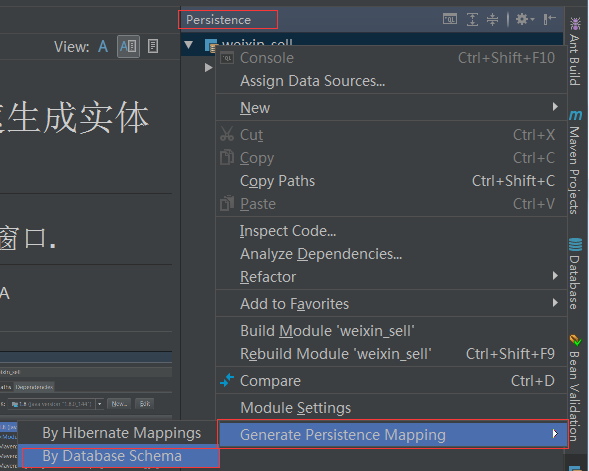

# idea 从胡数据库快速生成实体类

## 第一步,调出 Persistence 窗口.

File--->Project Structure--->model---> + --->JPA


## 第二步:打开 Persistence窗口



## 配置 生成实体类的参数


如图: 

* 1.数据源,即链接数据库的信息,按要求填写数据库信息即可

* 2.生成实体类的位置.

* 3.实体类名称前缀.这里我什么都没写.

* 4.实体类名称后缀. 这里我写Entity. 比如数据库表名为 user,那么生成实体类为 UserEntity

* 5.选择哪些表的哪些字段生成实体类.这里我全选.

* 6.生成的实体类自动添加 JPA注解.


## 最后点击ok,就能在我们的项目下看到生成的实体类


如:

```java
package com.itguang.weixinsell.entity;

import javax.persistence.Basic;
import javax.persistence.Column;
import javax.persistence.Entity;
import javax.persistence.Id;
import javax.persistence.Table;
import java.sql.Timestamp;

/**
 * @author itguang
 * @create 2017-11-25 14:02
 **/
@Entity
@Table(name = "product_category", schema = "sell", catalog = "")
public class ProductCategoryEntity {
    private int categoryId;
    private String categoryName;
    private int categoryType;
    private Timestamp createTime;
    private Timestamp updateTime;

    @Id
    @Column(name = "category_id")
    public int getCategoryId() {
        return categoryId;
    }

    public void setCategoryId(int categoryId) {
        this.categoryId = categoryId;
    }

    @Basic
    @Column(name = "category_name")
    public String getCategoryName() {
        return categoryName;
    }

    public void setCategoryName(String categoryName) {
        this.categoryName = categoryName;
    }

    @Basic
    @Column(name = "category_type")
    public int getCategoryType() {
        return categoryType;
    }

    public void setCategoryType(int categoryType) {
        this.categoryType = categoryType;
    }

    @Basic
    @Column(name = "create_time")
    public Timestamp getCreateTime() {
        return createTime;
    }

    public void setCreateTime(Timestamp createTime) {
        this.createTime = createTime;
    }

    @Basic
    @Column(name = "update_time")
    public Timestamp getUpdateTime() {
        return updateTime;
    }

    public void setUpdateTime(Timestamp updateTime) {
        this.updateTime = updateTime;
    }

    @Override
    public boolean equals(Object o) {
        if (this == o) return true;
        if (o == null || getClass() != o.getClass()) return false;

        ProductCategoryEntity that = (ProductCategoryEntity) o;

        if (categoryId != that.categoryId) return false;
        if (categoryType != that.categoryType) return false;
        if (categoryName != null ? !categoryName.equals(that.categoryName) : that.categoryName != null) return false;
        if (createTime != null ? !createTime.equals(that.createTime) : that.createTime != null) return false;
        if (updateTime != null ? !updateTime.equals(that.updateTime) : that.updateTime != null) return false;

        return true;
    }

    @Override
    public int hashCode() {
        int result = categoryId;
        result = 31 * result + (categoryName != null ? categoryName.hashCode() : 0);
        result = 31 * result + categoryType;
        result = 31 * result + (createTime != null ? createTime.hashCode() : 0);
        result = 31 * result + (updateTime != null ? updateTime.hashCode() : 0);
        return result;
    }
}

```


