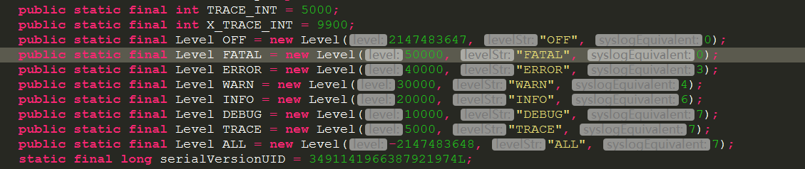

# Logback 日志框架

日志框架的能力:

* 1.定制输出目标

* 2.定制输出格式

* 3.携带上下文信息

* 4.运行时选择性输出

* 5.灵活的配置

* 6.优异的性能


spring boot 默认使用 Logback 日志框架.这是比Log4j更加优秀的日志框架,这两个框架的作者是同一个人,
作者本人都说,已经放弃Log4j.

使用如下:

```java
package com.itguang.weixinsell;

import org.junit.Test;
import org.junit.runner.RunWith;
import org.slf4j.Logger;
import org.slf4j.LoggerFactory;
import org.springframework.boot.test.context.SpringBootTest;
import org.springframework.test.context.junit4.SpringRunner;

/**
 * 日志测试类
 *
 * @author itguang
 * @create 2017-11-24 16:59
 **/
@RunWith(SpringRunner.class)
@SpringBootTest

public class LoggerTest {
    private final Logger logger = LoggerFactory.getLogger(LoggerTest.class);

    @Test
    public void test1(){
        logger.debug("debug.....");
        logger.info("info......");
        logger.error("error......");

    }


}

```
可以在需要输出日志的类上使用注解 @Slf4j ,注意需要添加相应依赖:

```xml
<!-- https://mvnrepository.com/artifact/org.projectlombok/lombok -->
		<dependency>
			<groupId>org.projectlombok</groupId>
			<artifactId>lombok</artifactId>
		
		</dependency>
```

使用如下:

```java

import lombok.extern.slf4j.Slf4j;
import org.junit.Test;
import org.junit.runner.RunWith;
import org.springframework.boot.test.context.SpringBootTest;
import org.springframework.test.context.junit4.SpringRunner;

/**
 * @author itguang
 * @create 2017-11-24 17:14
 **/
@RunWith(SpringRunner.class)
@SpringBootTest
@Slf4j
public class LoggerTest2 {


    @Test
    public void test1() {
        String name = "imooc";
        String password = "123456";
        log.debug("debug...");
        log.info("name: " + name + " ,password: " + password);
        //输出变量
        log.info("name: {}, password: {}", name, password);
        log.error("error...");
        log.warn("warn...");
    }


}

```

注意:idea可能会报错,但不影响运行.

参考这篇:http://www.bubuko.com/infodetail-1134725.html

再次注意一定要确保 lombok 安装成功


## Lobback 在Springboot 中的配置

两种方式:

* application.properties或者applecation.yml文件 : 相对简单,可做配置有限

* logback-spring.xml配置:可做详细配置

比如我们有如下需求:

区分info和error日志,每天产生一个日志文件

首先使用  application.properties或者applecation.yml文件 
```yaml
logging:
  pattern:
    #输出到控制台的格式 时间 - 信息(换行) 如:2017-11-25 08:28:23,481 - warn...
    console: "%d - %msg%n"
  # path: C:\ 配置日志输出路径,默认日志名称为 spring.log 可用如下方式指定输出日志文件的路径和名称
  file: C:\sell.log
  # 配置某个类日志输出级别
  level:
        com.itguang.weixinsell.LoggerTest2: debug

  # 配置应用程序日志输出级别
  #level: debug
```

接下来再使用: logback-spring.xml 配置,在resources 下新建文件 logback-spring.xml.注意命名规范 xxx-spring.log 

```xml
<?xml version="1.0" encoding="utf-8" ?>
<configuration >
 <!--配置输出格式-->
    <appender name="consoleLog" class="ch.qos.logback.core.ConsoleAppender">
        <layout class="ch.qos.logback.classic.PatternLayout">
            <pattern>
                %d - %msg%n
            </pattern>
        </layout>
    </appender>
    


    <!--应用到整个应用程序,配置日志级别,使用哪个 appender-->
    <root level="info">
        <appender-ref ref="consoleLog"/>
    </root>


</configuration>
```
以上是最简单的配置,完成后即可再次测试,发现日志输出格式已经被更改

那我们如果要按照时间策略,每天生成一个日志文件呢?可以这样配置

```xml
<?xml version="1.0" encoding="utf-8" ?>
<configuration>
    <!--配置ConsoleAppender-->
    <appender name="consoleLog" class="ch.qos.logback.core.ConsoleAppender">
        <layout class="ch.qos.logback.classic.PatternLayout">
            <pattern>
                %d - %msg%n
            </pattern>
        </layout>
    </appender>

    <!--配置RollingFileAppender-->
    <appender name="fileInfoLog" class="ch.qos.logback.core.rolling.RollingFileAppender">
        <encoder>
            <pattern>
                %msg%n
            </pattern>
        </encoder>
        <!--滚动策略-->
        <rollingPolicy class="ch.qos.logback.core.rolling.TimeBasedRollingPolicy">
            <!--日志路径名称-->
            <fileNamePattern>
                <!--日志名称以日期命名,即每天一个日志文件-->
                C:\sell-%d.log
            </fileNamePattern>
        </rollingPolicy>
    </appender>

    <!--应用到整个应用程序,配置日志级别,使用哪个 appender-->
    <root level="info">
        <appender-ref ref="consoleLog"/>
        <appender-ref ref="fileInfoLog"/>

    </root>


</configuration>
```
再次运行即可发现日志文件名称已经以每天日志自动命名

那我们如果想把不同的日志级别放在不同的日志文件中呢?

很简单,我们只需要在增加一个 appender ,设置一个fliter就行了
```xml
 <appender name="fileErrorLog" class="ch.qos.logback.core.rolling.RollingFileAppender">
        <!--配置只过滤Error级别的日志-->
        <filter class="ch.qos.logback.classic.filter.ThresholdFilter">
            <level>ERROR</level>
        </filter>
        <encoder>
            <pattern>
                %msg%n
            </pattern>
        </encoder>
        <!--滚动策略-->
        <rollingPolicy class="ch.qos.logback.core.rolling.TimeBasedRollingPolicy">
            <!--路径-->
            <fileNamePattern>
                C:\sell-error-%d.log
            </fileNamePattern>
        </rollingPolicy>
    </appender>
```

再次运行,就会发现路径下(我配置的是c盘根目录)多了一个sell-error-2017-11-25.log 的文件,打开发现里面只有 error级别的信息

我们知道,当我们配置了一个日志 level 后,大于这个日志 level 的level都会输出.


如:我们配置了 INFO ,那么 INFO 之上的 WARRN ,ERROR 等都会输出,但是INFO 之下的DEBUG 就不会输出.

现在加入我们已经配置了 INFO 级别的日志,还想将ERROR级别的日志过滤掉该怎莫办呢?

可以这样做: 借助于 LevelFilter,只需要在 appender节点下增加一个filter节点:

```xml
 <filter class="ch.qos.logback.classic.filter.LevelFilter">
            <!--过滤掉ERROR级别的日志,允许其他级别日志-->
            <level>ERROR</level>
            <onMatch>DENY</onMatch>
            <onMismatch>ACCEPT</onMismatch>
        </filter>
```

这样这个appender就不会记录 ERROR 级别的日志了.


